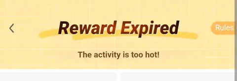

### Not every promo will show up for you

Which ones you get depends on the rules, your region, and your account. If you recently finished a promo, or got a cash payout, your account can be in a cooloff period and the same code will just not work for you. That can last anywhere from a day to over a month. Searching a code you don't have access to looks like this:

Nothing to do about it except check back later. The codes still work for other accounts.

### Getting a promo to show up anyway

1. Uninstall the app, wait at least 24 hours without logging in or touching the account from anywhere, then reinstall.
2. Make a new account from a different IP (VPN) and a different device (different MAC address).
3. Make a new account in a different region (VPN), use a different shipping address inside that region (you can change it at checkout), and do not link a PayPal account that has ever been used on Temu before.
4. Some promos just won't show up no matter what, and there's no forcing them. Don't lose hope. You'll get out of Temu jail eventually.
